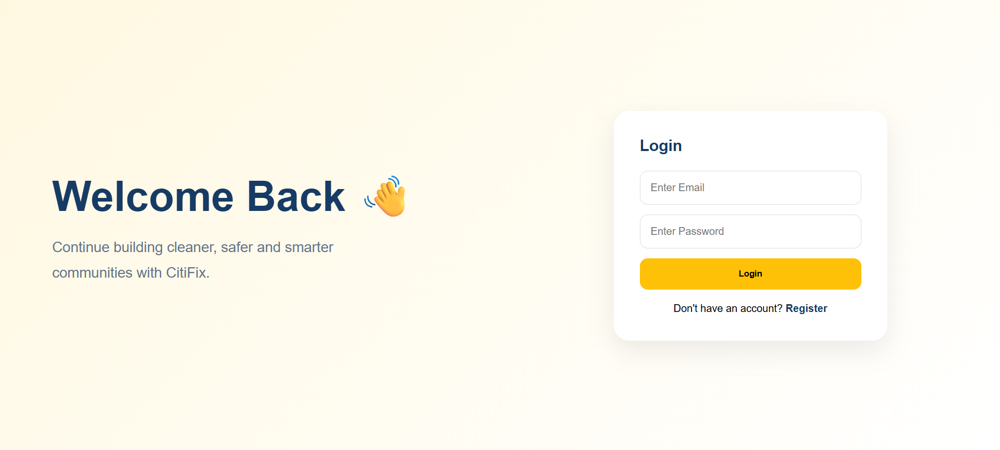
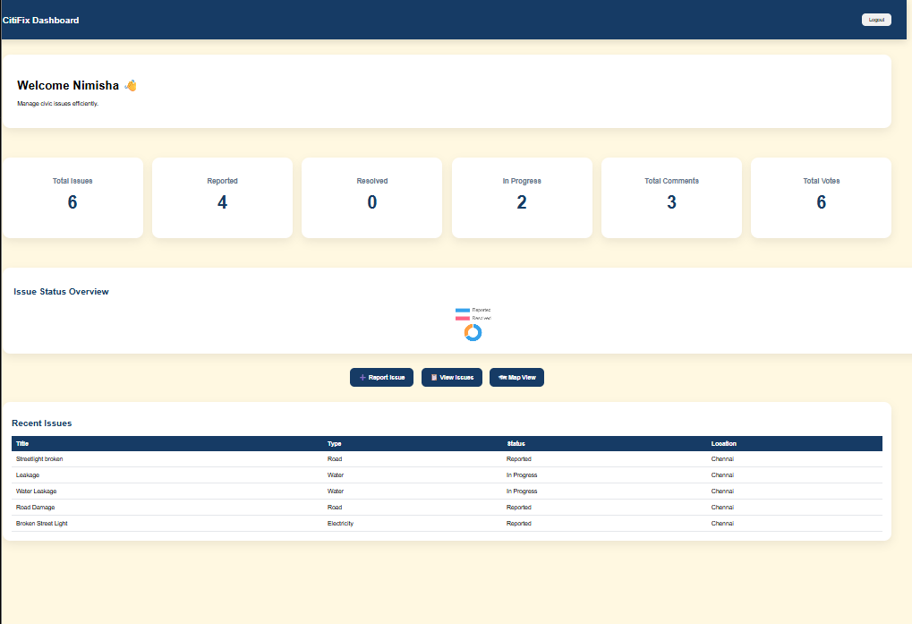
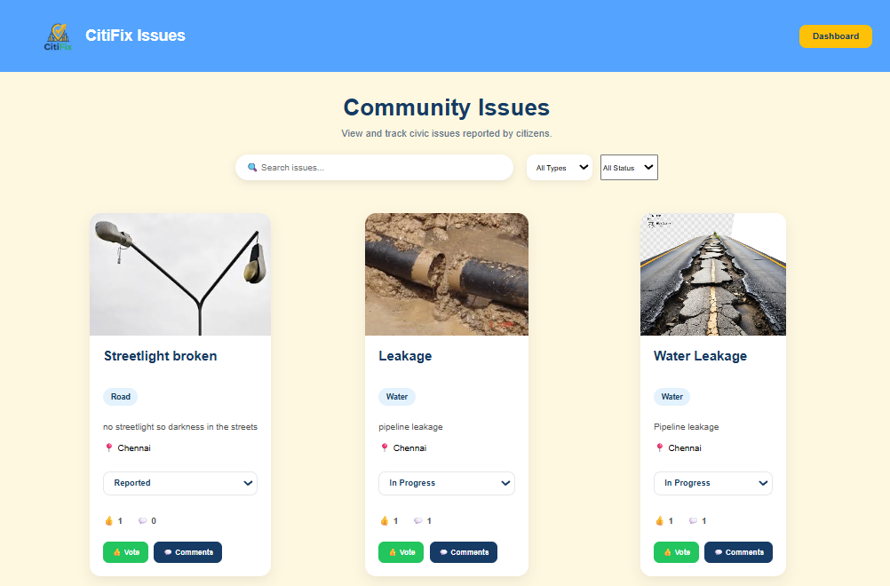
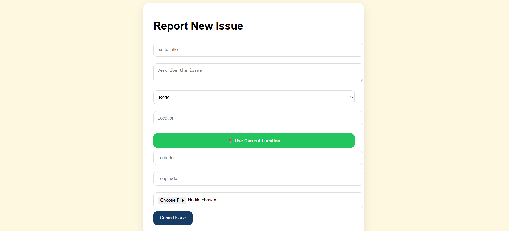

# CitiFix V2

CitiFix V2 is a civic issue reporting platform where citizens can register, report local problems, discuss them through comments, vote on priorities, and track issue status through a dashboard. The project combines a Flask REST API with a static front-end for reporting, browsing, and monitoring community issues.

## Features

- User registration and login with JWT authentication
- Report civic issues with image upload and location details
- Interactive dashboard with analytics and charts
- Browse and track community issues
- Vote on issues to highlight community priorities
- Add and view comments on issues
- Search issues by keyword
- Filter issues by type and status
- Update issue status (Reported, In Progress, Resolved)
- Interactive map view using issue coordinates
- Responsive design for desktop and mobile devices
- Admin-only issue deletion


## Tech Stack

- Backend: Flask
- Database: PostgreSQL via `psycopg2`
- Authentication: JSON Web Tokens
- Password hashing: `bcrypt`
- Frontend: HTML, CSS, JavaScript
- CORS: `flask-cors`

## Project Structure

```text
citifix_v2/
├── backend/
│   ├── app.py
│   ├── database.py
│   ├── requirements.txt
│   ├── routes/
│   ├── uploads/
│   └── utils/
├── frontend/
│   ├── index.html
│   ├── dashboard.html
│   ├── issues.html
│   ├── report.html
│   ├── login.html
│   ├── register.html
│   ├── map.html
│   ├── admin.html
│   ├── css/
│   └── js/
└── docs/
```

## Prerequisites

- Python 3.10+
- PostgreSQL database
- A browser for the static frontend

## Setup

### 1. Clone the repository

```bash
git clone <repository-url>
cd citifix_v2
```

### 2. Create a virtual environment

```bash
cd backend
python -m venv .venv
.venv\Scripts\activate
```

### 3. Install dependencies

```bash
pip install -r requirements.txt
```

### 4. Configure environment variables

Create a `.env` file inside `backend/` with your database credentials:

```env
DB_NAME=your_database_name
DB_USER=your_database_user
DB_PASSWORD=your_database_password
DB_HOST=localhost
DB_PORT=5432
```

### 5. Prepare the database

Create the required PostgreSQL tables for users, issues, comments, and votes before starting the app. The backend expects those tables to exist.

### 6. Start the backend

```bash
python app.py
```

The API runs at `http://127.0.0.1:5000` by default.

### 7. Open the frontend

Open any file in the `frontend/` folder in a browser, or serve the folder with a static file server / VS Code Live Server extension.

## Main API Endpoints

### Authentication

- `POST /register` - Create a new user account
- `POST /login` - Log in and receive a JWT token

### Issues

- `POST /issues` - Create a new issue
- `GET /issues` - List all issues
- `PUT /issues/<issue_id>` - Update issue status
- `DELETE /issues/<issue_id>` - Delete an issue as an admin
- `GET /my-issues/<user_id>` - Get issues created by a user
- `PUT /issues/<issue_id>/status` - Update issue status with authentication

### Comments

- `POST /comments` - Add a comment to an issue
- `GET /comments/<issue_id>` - Get comments for an issue
- `GET /comments/count/<issue_id>` - Get comment count for an issue

### Votes

- `POST /vote` - Vote on an issue
- `GET /issues/<issue_id>/votes` - Get vote count for an issue

### Analytics

- `GET /analytics` - Get overall dashboard metrics
- `GET /analytics/types` - Get issue counts by type
- `GET /analytics/top-issues` - Get the top voted issues

### Uploads

- `POST /upload-image` - Upload an issue image
- `GET /uploads/<filename>` - Serve uploaded images

## Authentication Notes

- Protected endpoints expect an `Authorization` header in the format `Bearer <token>`.
- Tokens are valid for 24 hours.
- Admin-only actions require a JWT with the `admin` role.

## Frontend Pages

- `index.html` - Landing page
- `login.html` - Login screen
- `register.html` - Account creation
- `report.html` - Issue submission
- `issues.html` - Browse and interact with issues
- `dashboard.html` - Overview and analytics
- `map.html` - Map-based issue view
- `admin.html` - Admin workflow

## Notes

- Uploaded files are stored in `backend/uploads/`.
- The backend enables CORS so the static frontend can talk to the API during local development.
- If you change the database schema or environment variables, restart the Flask server.


## Screenshots

### Login Page


### Dashboard


### Issues Page


### Report Issue Page


## License

No license has been specified yet.
#
